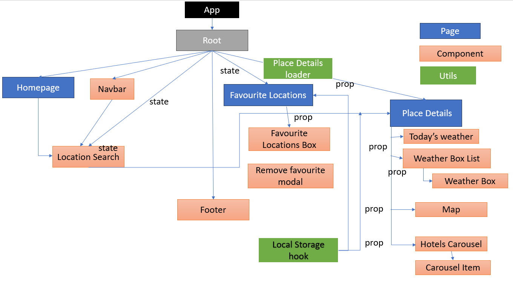

# User stories:

## User story 1
1)	As a user, when I access the application homepage, I would like to see a location search box that would allow me to search any town or city by name
## User story 2
2)	As a user I would like get a 5-day forecast after typing in a location name if the location can be found
## User story 3
3)	As a user I would like to see the day’s weather forecast of the location of my choice
## User story 4
4)	As a user I would like to be able to save a location as a favourite
## User story 5
5)	As a user I would like to be able to remove a location from favourites
## User story 6
6)	As a user I would like the application to be responsive for devices (mobile, tablet, desktop)

# Additional features:
## User story 7
7)	As a user I would like to see a map of a selected location
## User story 8
8)	As a user I would like to see a list of hotels in the selected location displayed on a carousel that can be moved on

## Component hierarchy

### Testing:

 #### Component testing for the following components, testing rendering.

- Navbar
- FavouriteLocationBox
- LocationSearch
- TodaysWeather
- WeatherBox
- WeatherBoxList
- Footer

#### Vitest unit testing for utilities testing logic: temperature formatter, date formatter.

#### API integration testing
#### Routing testing 

# State planning:

The state that got identified in the project is Location Search and this is the component that will be holding the state.
1.	Is it passed in from a parent via props?: No, it is not passed in from a parent via props.
2.	Does it remain unchanged over time?: No, it does not remain unchanged over time; its value may change based on user interactions, API calls, or other dynamic factors.
3.	Can it be computed from other state or props?: No, it cannot be computed from other state or props; it represents a standalone piece of data that is managed within the component.

## State is used in the following parts of the application:
####	Location Search:
- location: the location the user searched for 
#### Local Storage hook: sync list of locations state with local storage
-	Add location to Favourites
-	Remove from Favourites
#### Favourite Locations Page
-	favouriteLocations (uses hook): to display and remove locations
-	showModal: when we should render or hide the modal
-	locationToRemove: the location to remove from favourites
#### Place Details Page:
-	favouriteLocations (uses hook): to add to favourite locations
